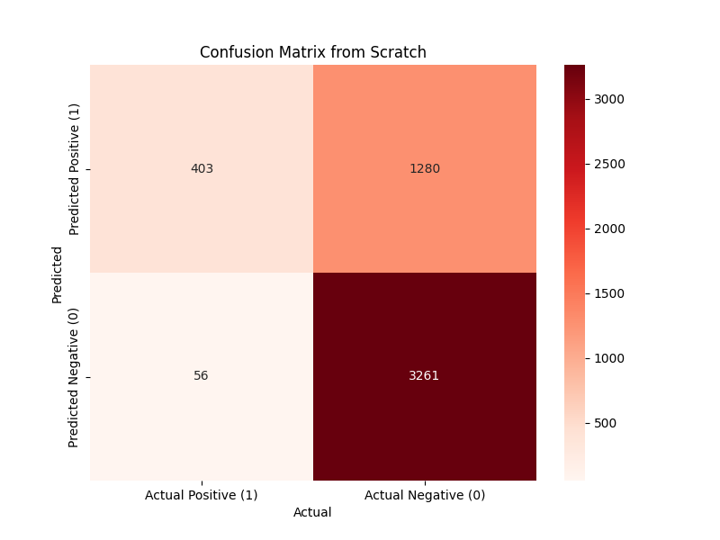
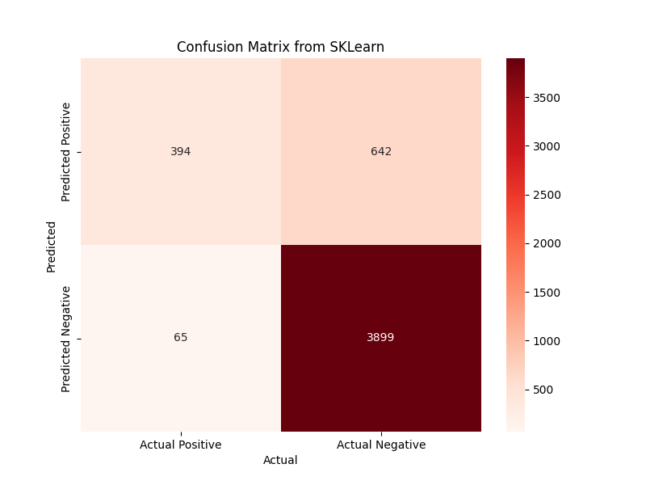

# Topic 4

## Logistic Regression

### Steps carried out
- Load the dataset
    - Check shape, columns, description, info
    - Inspect missing values, skewness
    - Since all features are numerical, check with Boxplot
        - Feature `sender_score` had non-negligble amount of outliers
    - Capped `sender_score` to 1th and 99th percentile
    - Checked for class imbalance using `df["is_spam"].value_counts(normalize=True)`

- Split the data in training and validation sets, using `stratify` so distribution of imbalance is same

- Scaled the data `.fit_transform()` for training and `transform()` for validation

- Performed `SMOTE` for training data to make it balanced for training
    - No use of `SMOTE` for validation, to prevent alteration of real world data

- Defined Logistic Regression class with Regularization as instructed 
    - Also defined custom functions for each evaluation metric: `accuracy`, `precision`, `recall`, `F1 Score`

- Created model instance, fitted and predicted and checked metrics

- **From Scratch:**

```
Accuracy: 0.733
Precision: 0.239
Recall: 0.878
F1 Score: 0.376
```

- **From SKLearn:**

```
Accuracy: 0.859
Precision: 0.38
Recall: 0.858
F1 Score: 0.527
```

- **Confusion Matrices**



